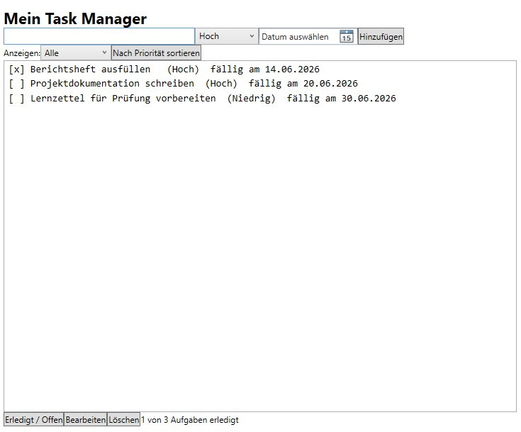
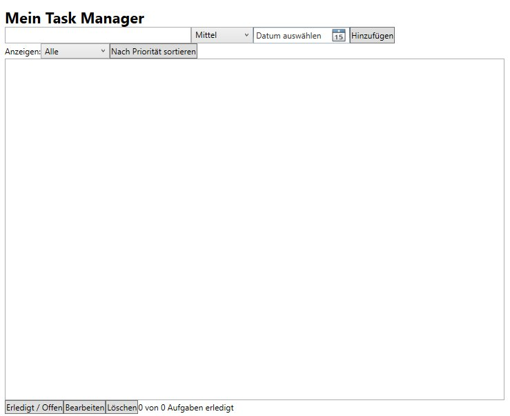

# TaskManager

Eine WPF-Anwendung zum Verwalten von Aufgaben, eigenständig konzipiert und umgesetzt im Rahmen meiner Umschulung zum Fachinformatiker für Anwendungsentwicklung.
Das Projekt zeigt den Umgang mit C# und .NET von der Idee bis zum lauffähigen Stand.

## Screenshots

Die App mit ein paar Beispiel-Aufgaben:

Und so sieht sie beim Start aus, noch ohne Aufgaben:

## Funktionen

- Aufgaben mit Priorität (Niedrig, Mittel, Hoch) anlegen
- Fälligkeitsdatum festlegen
- Aufgaben als erledigt oder offen markieren
- Aufgaben bearbeiten und löschen (vollständige CRUD-Funktionalität)
- Nach Priorität sortieren
- Aufgaben filtern (Alle, Offen, Erledigt)
- Übersicht über erledigte und offene Aufgaben

## Technik

- C# und .NET
- WPF für die Benutzeroberfläche
- Lokale Datenhaltung in einer Textdatei
